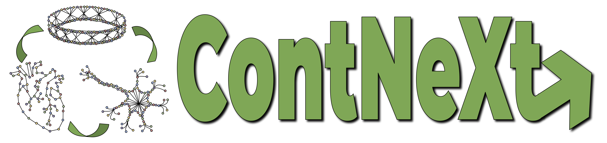

<p align="center">

</p>

<h1 align="center">
  ContNeXtViewer
</h1>


### ContNeXt WebApp

## 💪 Getting Started

ContNeXt is web application that allows the exploration of comprehensive context-specific portraits of biological processes using gene expression data, and the change in such portraits across different contexts.

## Command Line Interface

The ContNeXt Viewer command line tool is automatically installed. It can
be used from the shell with the `--help` flag to show all subcommands:

```shell
$ contnext_viewer --help
```

To load the ContNeXt Viewer database, use the `load` command:
```shell
$ contnext_viewer load [--source /path/to/network/data/directory ]
```
If no source path is given, contnextViewer automatically downloads the necessary data from the project's Zenodo's page [](https://doi.org/10.5281/zenodo.5831786).

To run the ContNeXt Viewer webapp, use the `web` command:
```shell
$ contnext_viewer web [--host 0.0.0.0 ] [ --port 5000 ] [ --template path/to/template] [ --static path/tp/static]
```

## 🚀 Installation

<!-- Uncomment this section after your first ``tox -e finish``
The most recent release can be installed from
[PyPI](https://pypi.org/project/contnextViewer/) with:

```bash
$ pip install contnext_viewer
```
-->

The most recent code and data can be installed directly from GitHub with:

```bash
$ pip install git+https://github.com/ContNeXt/web_app.git
```

To install in development mode, use the following:

```bash
$ git clone git+https://github.com/ContNeXt/web_app.git
$ cd web_app.git
$ pip install -e .
```

## ContNeXt Data

ContNeXt's data can be downloaded directly from the project's Zenodo page [](https://doi.org/10.5281/zenodo.5831786).

To correctly load the ContNeXt Viewer database, the source data must have 
the following structure:
```
.
├── coexpr_networks 
│   ├── tissue 
│   │   ├── <UBERON ID>
│   │   │   └── coexp_network_edges.tsv
│   │   └── ... x46
│   ├── cell_type
│   │   ├── <CL ID> 
│   │   │   └── coexp_network_edges.tsv
│   │   └── ... x30
│   └── cell_line 
│       ├── <CLO ID> 
│       │   └── coexp_network_edges.tsv
│       └── ... x22
│
├── controllability_analysis
│   ├── interactome_edge_classifications.tsv
│   ├── interactome_indispensable_edges.txt
│   ├── interactome_indispensable_nodes.txt
│   ├── interactome_node_classifications.tsv
│   ├── interactome_summary.tsv
│   ├── interactome.linktype
│   ├── interactome.nodemap
│   ├── interactome.nodetype
│   └── interactome.output
│
├── data_for_coexp_network_construction
│   ├── organism.part 
│   │   ├── <UBERON ID>
│   │   │   ├── datasets.txt
│   │   │   └── metadata.tsv
│   │   └── ... x46
│   ├── cell.type
│   │   ├── <CL ID> 
│   │   │   ├── datasets.txt
│   │   │   └── metadata.tsv
│   │   └── ... x30
│   └── cell.line 
│       ├── <CLO ID> 
│       │   ├── datasets.txt
│       │   └── metadata.tsv
│       └── ... x22
│
├── interactome 
│   ├── interactome_18_01_2021.tsv 
│   └── interactome_edges.tsv 
│
├── mappings 
│   ├── CL_name_mappings.json
│   ├── CLO_name_mappings.json
│   ├── doid_name_mappings.json
│   ├── hgnc_name_mappings.json
│   └── uberon_name_mappings.json
│
├── metadata 
│   ├── final_metadata.tsv
│   ├── gemma_dump_FINAL.tsv
│   ├── gemma_dump_ontologies.tsv
│   ├── metadata_before_curation_shortened.tsv
│   ├── metadata_before_curation.tsv
│   ├── metadata_for_manual_curation_shortened.tsv
│   ├── metadata_for_manual_curation.tsv
│   ├── metadata_manual_curation_version_shortened.tsv
│   ├── metadata_manual_curation_version.tsv
│   ├── metadataFinal_afterDataLoading.RData
│   └── metadataFinal_afterDataLoading.tsv
│
├── misc_data
│   ├── tissue_neighbors.json
│   ├── cell-type_neighbors.json
│   ├── cell-line_neighbors.json
│   ├── tis_100000most_common_edges.json
│   ├── ct_100000most_common_edges.json
│   ├── cl_100000most_common_edges.json
│   ├── tissue_overview.tsv
│   ├── celltype_overview.tsv
│   ├── cellline_overview.tsv
│   ├── FULL_tissue_overview_after_download.tsv
│   ├── FULL_celltype_overview_after_download.tsv
│   ├── FULL_cellline_overview_after_download.tsv
│   ├── FULL_tissue_overview.tsv
│   ├── FULL_celltype_overview.tsv
│   ├── FULL_cellline_overview.tsv
│   ├── pairwise_similarity_tissues.tsv
│   ├── pairwise_similarity_cell_types.tsv
│   ├── pairwise_similarity_cell_lines.tsv
│   └── HK_genes.txt
│
├── node_properties
│   ├── interactome_node_properties.tsv 
│   ├── tissue
│   │   ├── <UBERON ID> 
│   │   │   └── node_properties.tsv
│   │   └── ... x46
│   ├── cell_type  
│   │   ├── <CL ID>  
│   │   │   └── node_properties.tsv
│   │   └── ... x30
│   └──  cell_line
│       ├── <CLO ID> 
│       │   └── node_properties.tsv
│       └── ... x22
│
└── pathway
    ├── gene_pathway_assignment.json
    ├── kegg_hgnc_ids.gmt
    └── kegg_mapping.json

```
## 👐 Contributing

Contributions, whether filing an issue, making a pull request, or forking, are appreciated. See
[CONTRIBUTING.rst](https://github.com/ContNeXt/web_app/blob/master/CONTRIBUTING.rst) for more information on getting involved.

## 👋 Attribution

### ⚖️ License

The code in this package is licensed under the MIT License.

<!--
### 📖 Citation

Citation goes here!
-->

<!--
### 🎁 Support

This project has been supported by the following organizations (in alphabetical order):

- [Harvard Program in Therapeutic Science - Laboratory of Systems Pharmacology](https://hits.harvard.edu/the-program/laboratory-of-systems-pharmacology/)

-->

<!--
### 💰 Funding

This project has been supported by the following grants:

| Funding Body                                             | Program                                                                                                                       | Grant           |
|----------------------------------------------------------|-------------------------------------------------------------------------------------------------------------------------------|-----------------|
| DARPA                                                    | [Automating Scientific Knowledge Extraction (ASKE)](https://www.darpa.mil/program/automating-scientific-knowledge-extraction) | HR00111990009   |
-->

### 🍪 Cookiecutter

This package was created with [@audreyfeldroy](https://github.com/audreyfeldroy)'s
[cookiecutter](https://github.com/cookiecutter/cookiecutter) package using [@cthoyt](https://github.com/cthoyt)'s
[cookiecutter-snekpack](https://github.com/cthoyt/cookiecutter-snekpack) template.

## 🛠️ For Developers

<details>
  <summary>See developer instrutions</summary>

  
The final section of the README is for if you want to get involved by making a code contribution.

 <!--
### ❓ Testing

After cloning the repository and installing `tox` with `pip install tox`, the unit tests in the `tests/` folder can be
run reproducibly with:

```shell
$ tox
```

Additionally, these tests are automatically re-run with each commit in a [GitHub Action](https://github.com/ContNeXt/web_app/actions?query=workflow%3ATests).
-->

### 📦 Making a Release

After installing the package in development mode and installing
`tox` with `pip install tox`, the commands for making a new release are contained within the `finish` environment
in `tox.ini`. Run the following from the shell:

```shell
$ tox -e finish
```

This script does the following:

1. Uses BumpVersion to switch the version number in the `setup.cfg` and
   `src/contnext_viewer/version.py` to not have the `-dev` suffix
2. Packages the code in both a tar archive and a wheel
3. Uploads to PyPI using `twine`. Be sure to have a `.pypirc` file configured to avoid the need for manual input at this
   step
4. Push to GitHub. You'll need to make a release going with the commit where the version was bumped.
5. Bump the version to the next patch. If you made big changes and want to bump the version by minor, you can
   use `tox -e bumpversion minor` after.
</details>
